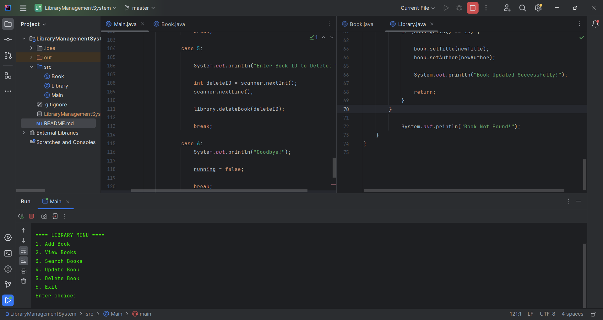

# service.Library Management System (Java)

A console-based service.Library Management System built using Java and Object-Oriented Programming principles.

## Features

- Add Book
- View Books
- Search Books
- Update Books
- Delete Books
- File Persistence
- Input Validation
- Exception Handling

## Concepts Used

- Classes and Objects
- Constructors
- Encapsulation
- Getters and Setters
- ArrayList
- Loops
- Switch Statements
- Scanner Input
- CRUD Operations

## Technologies

- Java
- IntelliJ IDEA
- Git
- GitHub

## Screenshot

## Author

Sajidh Yazeen